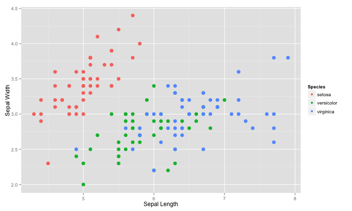

## Introduction 

Two names are associated with this famous dataset: Edgar Anderson, who collected the measurements of three related species of the iris flower, and Sir Ronald Fisher, who in 1936, introduced the multivariate dataset as an example of linear discriminant analysis.

The data set consists of 50 samples from each of three species of Iris (setosa, virginica and versicolor). Four features were measured from each sample: the length and the width of the sepals and petals, in centimetres.

---

## Examining the data

The Iris Dataset Tool is available [here](http://ppillay.shinyapps.io/shinyProj/).

On starting up the tool set, the user is presented with a *Welcome* screen. Various approaches are provided for studying the original dataset:
+ A histogram of each measurement, selected from a dropdown and displayed on the *Histogram* tab
+ A statistical summary of each measurement, selected with the same dropdown and displayed on the *Summary* tab
+ A couple of plots are presented of petal width vs length, and sepal width vs length, displayed on the *Plot* tab

---

## Plot data

The sepal width vs length plot is reproduced here:

 

---

## Predicting new iris specimens

Departing from Fisher's original work, this tool contains a predictive model built using the random forests approach. The user can adjust the sliders in the sidebar to describe a new iris specimen and the the Prediction tab will display the suggested iris category.

Revewers can test the model by using the graphs from the Plot tab to suggest a set of measurements and the expected iris species.

